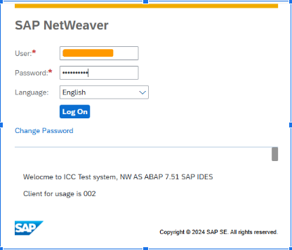
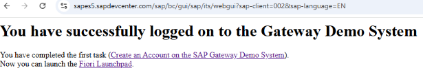
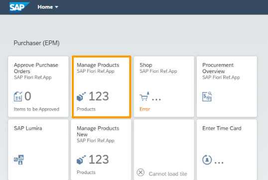
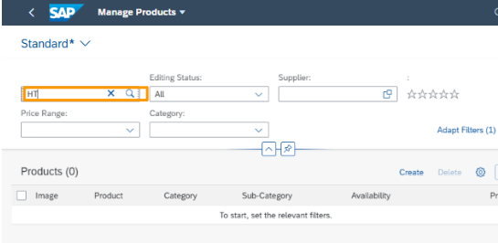
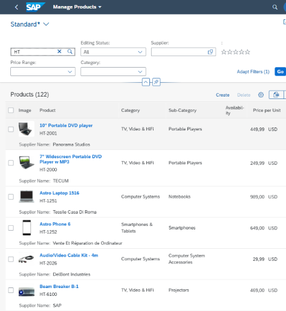
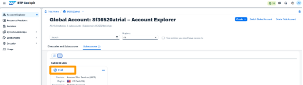
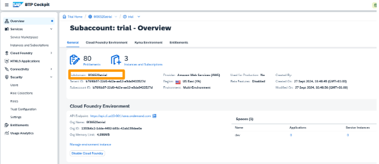
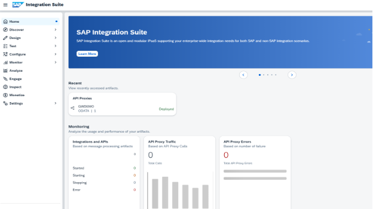
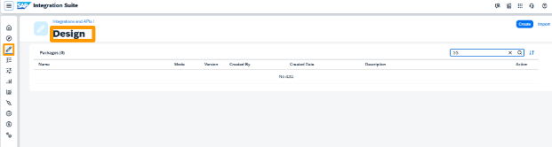
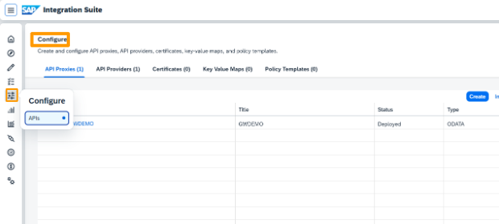

# SETTING UP SAP GATEWAY DEMO SYSTEM ACCOUNT & SAP INTEGRATION SUITE

## Create an Account on the SAP Gateway Demo System (ES5)

### Aim of Hands-on 
To create a free account in the SAP Gateway Demo System (ES5).

### Business Scenario
The SAP Gateway Demo System is used, for example, to try OData Services. Various sample services are implemented for this purpose.. It is based on SAP NetWeaver AS ABAP 7.51.  These services are accessible via the internet. In this exercise, the GWSAMPLE_BASIC service  is used which is based on the Enterprise Procurement Model (EPM).

### Task Flow
In this exercise, I performed the following tasks:

1.  Created a new SAP Gateway Demo System Access.
2.  Navigated to SAP Gateway SAP GUI for HTML.
3.  Changed the password.
4.  Opened SAP Fiorified Launchpad Menu.

### Prerequisites
1.  A browser and internet access.
2.  An SAP account. 

### Outcome After This Exercise
A working account in the SAP Gateway Demo System (ES5) with which I can consume OData APIs based on the EPM SalesOrder model.

### Environment
Live SAP BTP account.

### Task 1: I created a New SAP Gateway Demo Access
#### Steps
1.  Created a new SAP Gateway Demo System Access.
    1.  Opened a fresh chrome browser window.
    2.  Log on to https://register.sapdevcenter.com/SUPSignForms/
    3.  Entered SAP ID User / E-Mail to register.
    4.  Registered SAP ID Service account retrieved my user details.
    5.  Checked the I have read and understood the Terms and Conditions box.
    6.  Chose the Register button.
    7.  Received a success message for my registration via E-Mail.
    8.  Did not close this successful registration step page.
    9.  On that page, I selected Show password and noted it.
    10. Log on to https://sapes5.sapdevcenter.com and logon with my credentials.
    11. Changed my logon credentials as forced.
    12. I have successfully registered on the ES5 Gateway System.

### Task 2: I opened the SAP Fiorified Launchpad Menu
#### Steps
1.  Log on to the SAP Easy Access page.
    1.  Opened https://sapes5.sapdevcenter.com/sap/bc/gui/sap/its/webgui# and log on with my user and password.

    

    2.  Checked that I have successfully logged on to the Gateway Demo System.

    

    3.  Opened the fiorified Launchpad.
    4.  Chose the menu entry Manage Products

    

    5.  Entered HT as productID and hit Enter to show the available products.

     

    6.  Found out the following product details:

    

    7.  Used this function to check whether the productIDs are present in order to verify the processing.

## Log in to My SAP Integration Suite

### Aim of Hands-on 
This exercise aims to confirm the Integration Suites has API Management and Cloud Integration capabilities.

### Business Scenario
An integration developer should create new API proxies in API Management and these should then be used in an iFlow with the Cloud Integration Runtime.

### Task Flow
In this exercise, I performed the following tasks:
1.  Logged in to my SAP BTP Trial Account.
2.  Logged in to the Integration Suite.
3.  Checked out the provisioned capabilities.

### Prerequisites
I created a trial account and used it for the exercises. 
  **An Integration Developer user was set up with the following role collections.**
- AuthGroup.API.ApplicationDeveloper
- APIManagement.SelfService.Administrator
- APIPortal.Administrator
- APIPortal.Service.CatalogIntegration
- PI_Integration_Developer
- Subaccount Viewer
 The creation of a subaccount is described in a tutorial in the Useful Links section

### Outcome After This Exercise
I was able to log in with a User and Password to my subaccount tenant and in the Integration Suite. I also confirmed the Integration Suites had API Management and Cloud Integration capabilities.

### Task 1: I Log in to the SAP BTP Account
#### Steps
1.  Logged in to the SAP Integration Suite.
    1.  Opened my Browser and entered 
        https://cockpit.hanatrial.ondemand.com/trial/#/home/trial.
    2.  Logged in with my user and password when prompted.
    3.  Clicked on the **"Go To Your Trial Account"**- button.
    4.  Clicked the name of my subaccount. In this case, it is trial.

    

    5.  When I successfully logged in to my subaccount, the cockpit of my subaccount opened.

    

### Task 2: Log in to My Integration Suite
#### Steps
1.  Logged in to my Integration Suite.
    1.  Navigated to Services → Instances and Subscriptions. Chose the link Integration Suite.
    2.  The SAP Integration Suite Start page opened. This showed that everything worked as expected

    

    3.  Scrolled down until I saw the Capabilities section. At least the Build Integration Scenarios and Manage APIs tiles must be present.
    4.  Checked that at least the Build Integration Scenarios and Manage APIs tiles displayed.

### Task 3: Checked out the Available Capabilities
#### Steps
1.  Checked out the available Capabilities.
    1.  Chose the navigation entry Design → Integrations and APIs.
    2.  The cloud Integration Design view opened.

    

    3.  Navigated back to Configure and chose APIs.
    4.  The Configure API Management view opened. This showed everything worked as expected.

    

    5.  This means that API management and cloud integration were set up correctly and have the authorization to access them.

### Useful Links
- [Create a Free Account on SAP BTP Trial](https://developers.sap.com/tutorials/hcp-create-trial-account.html)

- [Documentation of GWSAMPLE_BASIC | Introducing OData](https://help.sap.com/docs/SAP_NETWEAVER_AS_ABAP_751_IP/68bf513362174d54b58cddec28794093/59283fc4528f486b83b1a58a4f1063c0.html?version=7.51.4)

### Credit 
**© 2024 SAP SE or an SAP affiliate company. All rights reserved.**  
*This repository references SAP materials for educational purposes, in accordance with SAP's copyright guidelines.*
